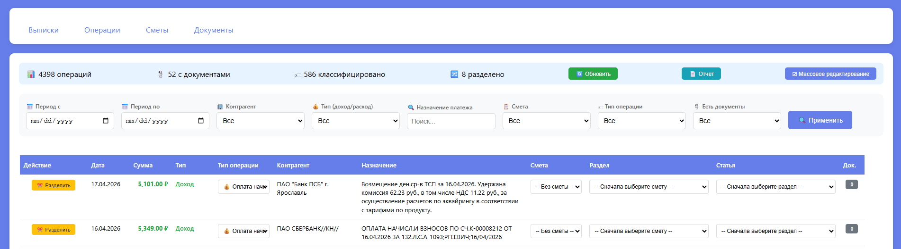
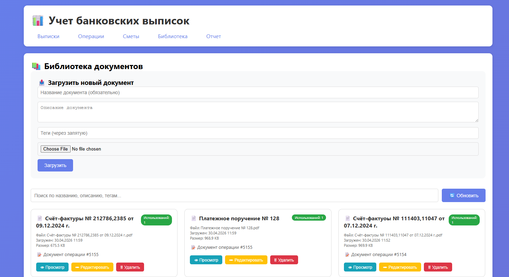
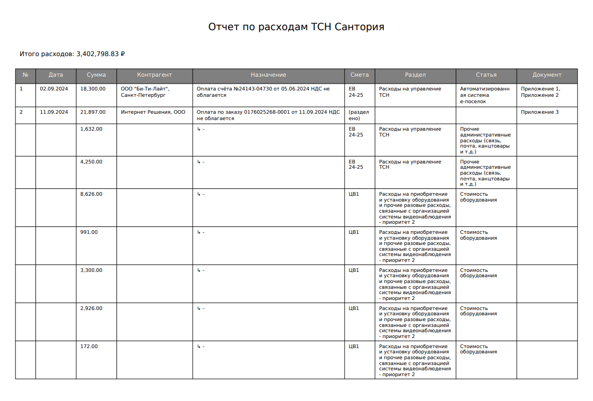

# 🏦 TSNFinance — Учёт банковских выписок и смет

[](https://www.python.org/)
[](https://flask.palletsprojects.com/)
[](https://www.sqlite.org/)
[](LICENSE)

**Веб-приложение для автоматизации учёта банковских выписок, классификации расходов по сметам и формирования отчётности с приложениями.**

## 📌 Основные возможности

- **Загрузка выписок** в формате 1С (текстовый формат)
- **Управление сметами** — иерархическая структура: Смета → Раздел → Статья
- **Классификация операций** — назначение статей сметы с фильтрацией и массовым редактированием
- **Разделение операций** — распределение суммы одной операции по нескольким статьям
- **Библиотека документов** — централизованное хранение PDF-файлов с возможностью многократного использования
- **Гибкие фильтры** — по датам, контрагентам, типу операций, наличию документов
- **Формирование отчётов в PDF** — таблица операций с приложениями, автоматическая нумерация и встраивание документов

## 🖼️ Скриншоты

| Страница операций | Управление сметами |
|:---:|:---:|
|  |  |

| Библиотека документов | Сформированный отчёт |
|:---:|:---:|
|  |  |

## 🚀 Быстрый старт

### Установка

```bash
# Клонирование репозитория
git clone https://github.com/yourusername/TSNFinance.git
cd TSNFinance

# Создание виртуального окружения
python -m venv .venv
source .venv/bin/activate  # Linux/Mac
# или
.venv\Scripts\activate  # Windows

# Установка зависимостей
pip install -r requirements.txt

python app.py
